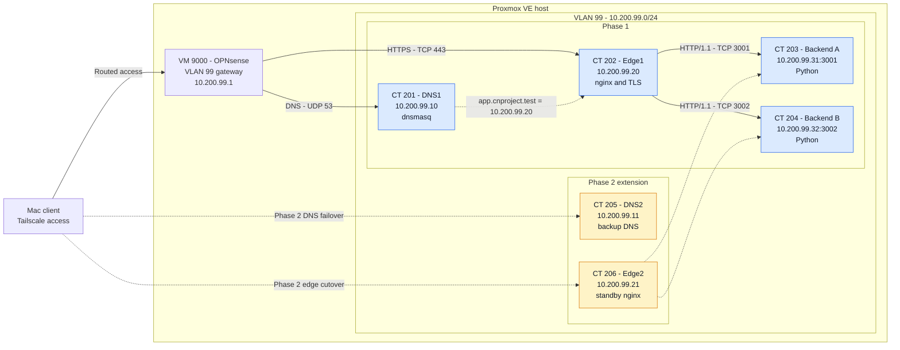

# Private DNS, HTTPS and Load-Balanced Service Platform

An individual Computer Networks project implemented with Proxmox LXC containers, OPNsense network segmentation, private DNS, nginx, Python backends, TLS and Wireshark packet analysis.

| Item | Details |
| --- | --- |
| Author | Mahir, 2401010256 |
| Current scope | Phase 1 |
| Project network | OPNsense VLAN 99, `10.200.99.0/24` |
| Virtualization | Proxmox VE with separate LXC containers |
| Demonstration | [Phase 1 recording on Google Drive](https://drive.google.com/drive/folders/1SVjw0JjsixaM0_xOpkwaDQ1-8z1HvW2b?usp=drive_link) |

## Objectives

The project demonstrates:

- private DNS resolution for `app.cnproject.test`;
- trusted HTTPS without disabling certificate validation;
- HTTP/1.1 and HTTP/2 support at the nginx edge;
- round-robin distribution across two independent Python backends;
- HTTP caching with `Cache-Control`, ETag and `304 Not Modified`;
- continued service when one backend is stopped;
- packet-level DNS, TCP and TLS analysis in Wireshark.

## Architecture



OPNsense runs as VM 9000 on the Proxmox host. It routes traffic entering or leaving VLAN 99 and separates the project network from other network segments. Proxmox's VLAN-aware Linux bridge switches traffic directly between containers that share VLAN 99.

See [Architecture and protocol flow](docs/architecture.md) for the full request path.

## Phase 1 components

| ID | Hostname | Address | Responsibility |
| --- | --- | --- | --- |
| 201 | `cn-dns1` | `10.200.99.10/24` | Private DNS using dnsmasq on UDP/TCP 53 |
| 202 | `cn-edge1` | `10.200.99.20/24` | TLS termination and nginx load balancing on TCP 443 |
| 203 | `cn-app-a` | `10.200.99.31/24` | Python Backend A on TCP 3001 |
| 204 | `cn-app-b` | `10.200.99.32/24` | Python Backend B on TCP 3002 |

All Phase 1 containers use `eth0`, VLAN tag `99` and gateway `10.200.99.1`.

### Private DNS

DNS1 resolves the private application names to Edge1 with a 30-second TTL:

```text
app.cnproject.test -> 10.200.99.20
api.cnproject.test -> 10.200.99.20
```

The deployed configuration is stored in [dnsmasq-cn-dns1.conf](phase1/configs/dnsmasq-cn-dns1.conf).

### HTTPS edge and load balancing

nginx accepts trusted HTTPS connections on TCP 443 and forwards requests to the `cn_backends` upstream group. With both backends available, nginx's default round-robin method distributes new requests across A and B.

The edge configuration is stored in [nginx-cn-edge1.conf](phase1/configs/nginx-cn-edge1.conf).

### Python backends

Both backend containers run the same standard-library Python application. Environment variables assign the backend identity and listening port.

| Endpoint | Behavior |
| --- | --- |
| `/` | Returns the selected backend identity |
| `/api/status` | Returns health JSON with `X-Backend` and `Cache-Control: no-store` |
| `/api/cache` | Returns cacheable JSON with `max-age=60`, ETag and 304 support |

The source is stored in [app.py](phase1/backend/app.py), with deployment instructions in [phase1/backend](phase1/backend/README.md).

### TLS trust

The certificate covers `app.cnproject.test` and `api.cnproject.test`. Its public copy is included for inspection. The private key remains only on Edge1 and is excluded from version control.

See [TLS setup and trust](docs/tls-setup.md).

## Evidence

| Requirement | Evidence |
| --- | --- |
| Private DNS answer and TTL | [DNS packet details](evidence/phase1/screenshots/dns-answer-details.png) and [verification results](evidence/phase1/verification-results.md#dns-lookup) |
| TCP three-way handshake | [SYN, SYN-ACK and ACK screenshot](evidence/phase1/screenshots/tcp-three-way-handshake.png) |
| TLS negotiation and encryption | [TLS stream screenshot](evidence/phase1/screenshots/tls-stream-overview.png) |
| HTTPS and certificate validation | [Trusted HTTPS result](evidence/phase1/verification-results.md#trusted-https-response) |
| HTTP protocol support | [HTTP/1.1 and HTTP/2 result](evidence/phase1/verification-results.md#http-protocol-versions) |
| Round-robin behavior | [Backend A and B responses](evidence/phase1/verification-results.md#backend-round-robin) |
| HTTP caching | [200 and 304 results](evidence/phase1/verification-results.md#cache-validation) |
| Backend failure recovery | [Controlled failure result](evidence/phase1/verification-results.md#backend-failure-test) and [recording](https://drive.google.com/drive/folders/1SVjw0JjsixaM0_xOpkwaDQ1-8z1HvW2b?usp=drive_link) |

The [packet evidence guide](evidence/phase1/README.md) documents both the untouched capture and a focused 30-packet capture with packet numbers, filters and SHA256 hashes.

## Repository structure

```text
.
├── README.md
├── docs
│   ├── architecture.md
│   ├── tls-setup.md
│   └── verification.md
├── evidence
│   └── phase1
│       ├── README.md
│       ├── verification-results.md
│       ├── phase1-original-live-capture.pcapng
│       ├── phase1-dns-tcp-tls.pcapng
│       └── screenshots
└── phase1
    ├── backend
    │   ├── app.py
    │   ├── backend-a.env.example
    │   ├── backend-b.env.example
    │   ├── cn-backend.service
    │   └── README.md
    ├── configs
    │   ├── dnsmasq-cn-dns1.conf
    │   ├── nginx-cn-edge1.conf
    │   └── README.md
    └── tls
        └── cnproject-public.crt
```

## Verification

Follow the [verification guide](docs/verification.md) to reproduce DNS, backend, TLS, HTTP, caching, failure and packet-analysis checks.

## Security

- Passwords, SSH private keys and TLS private keys are excluded.
- The repository contains only the public TLS certificate.
- Certificate verification remains enabled in every HTTPS test.
- No verification command uses `curl -k`.
