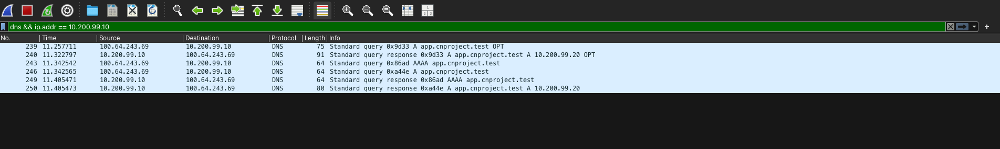
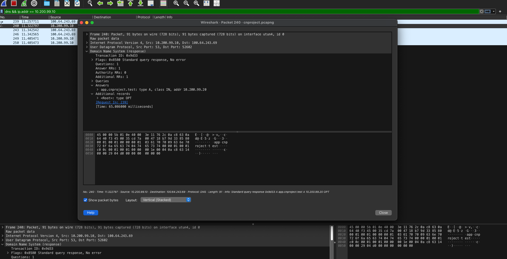
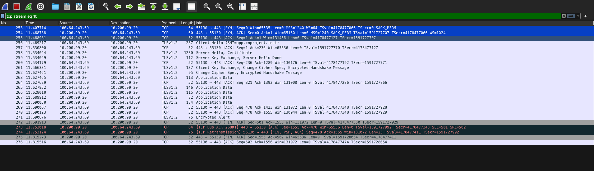
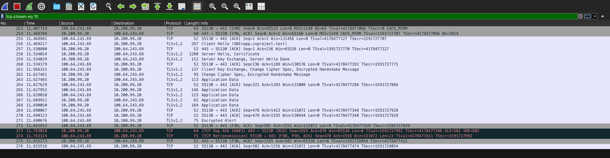

# Phase 1 Packet Evidence

This directory preserves the original live capture, a focused project capture and screenshots used to verify DNS, TCP and TLS behavior.

## Capture files

### Original live capture

[`phase1-original-live-capture.pcapng`](phase1-original-live-capture.pcapng) is the untouched Wireshark capture recorded during the Phase 1 demonstration on 30 September 2026.

| Property | Value |
| --- | --- |
| Packets | 389 |
| Interface | `utun4` |
| Encapsulation | Raw IP |
| SHA256 | `93fafb7ed51696c003ced5cab468c8824244ddb6ed5e38d23dc461405850961a` |

The original file includes normal background traffic present on the capture interface.

### Focused project capture

[`phase1-dns-tcp-tls.pcapng`](phase1-dns-tcp-tls.pcapng) contains only the assessed DNS lookup and HTTPS TCP/TLS stream from the original capture.

| Property | Value |
| --- | --- |
| Packets | 30 |
| Interface | `utun4` |
| Encapsulation | Raw IP |
| SHA256 | `f207d2aa80c027e262e36060f7483e4e7474b09ac0f1b41013edd7b3d7c423e7` |

## DNS evidence

Display filter:

```text
dns && ip.addr == 10.200.99.10
```

| Packet | Observation |
| --- | --- |
| 1 | Client `100.64.243.69:52602` queries DNS1 `10.200.99.10:53` for `app.cnproject.test` |
| 2 | DNS1 returns A record `10.200.99.20` with TTL 30 |

Packets 3 to 6 contain the A and AAAA lookups generated by the HTTPS request.





## TCP evidence

Display filter:

```text
tcp.stream == 0
```

| Packet | Observation |
| --- | --- |
| 7 | Client port 55130 sends SYN to Edge1 port 443 |
| 8 | Edge1 sends SYN-ACK with acknowledgment 1 |
| 9 | Client sends ACK and completes the connection |

The sequence establishes the reliable, ordered TCP connection before TLS begins.



## TLS evidence

Display filter:

```text
tcp.stream == 0 && tls
```

| Packet | Observation |
| --- | --- |
| 10 | TLS 1.2 ClientHello with SNI `app.cnproject.test` |
| 12 | ServerHello and Certificate |
| 13 | Server Key Exchange and Server Hello Done |
| 15 | Client Key Exchange and ChangeCipherSpec |
| 16 | Server ChangeCipherSpec |
| 17 to 22 | Encrypted Application Data |

The HTTP headers and JSON body are not readable in the capture because TLS encrypts the application data.



## Screenshot packet numbering

The screenshots were taken from the 389-packet original capture. The focused capture preserves the same network events with packet numbers 1 to 30, so the screenshot packet numbers are higher than the table references above.

## Supporting evidence

- [Observed verification results](verification-results.md)
- [Reproducible verification guide](../../docs/verification.md)
- [Phase 1 demonstration recording](https://drive.google.com/drive/folders/1SVjw0JjsixaM0_xOpkwaDQ1-8z1HvW2b?usp=drive_link)
